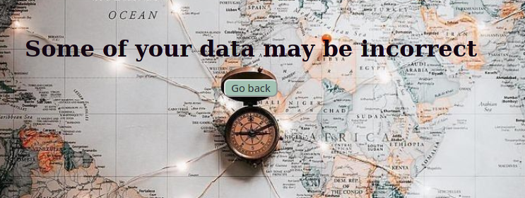

## Find your friends now!

This project allows you to find friends' locations on the map according to the user's name you've provided

## Home page

Here is how the home page looks like:

After user inputs data he'll be redirected either to the failure page (if there is a mistake) or to the map page with markers on it if there are any frineds for the given user

## Modules

## for web app project
bog.py - module with flask framework
find_frinds.py - works with bearer token and user name to create a json file with all user friends in it
third_main.py - to generate map

## for second task
sec_main.py - module for second task, to work with json file - it's keys etc.
